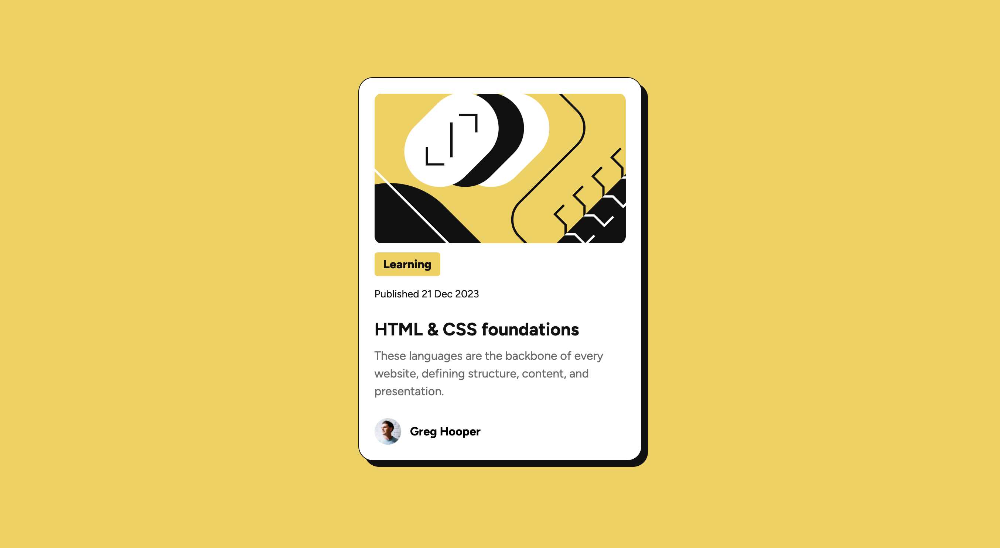
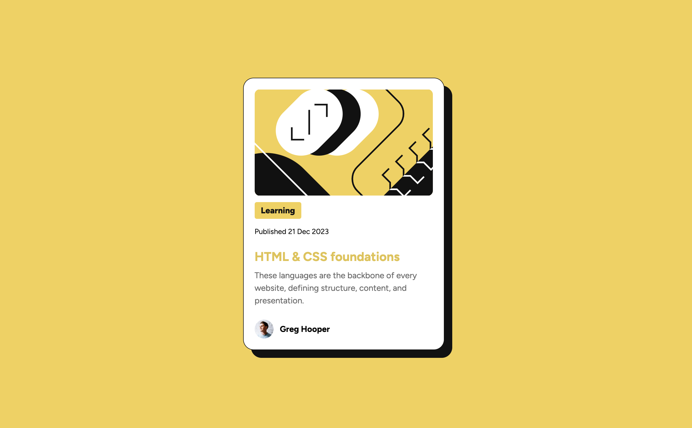

# Frontend Mentor - Blog preview card solution

This is a solution to the [Blog preview card challenge on Frontend Mentor](https://www.frontendmentor.io/challenges/blog-preview-card-ckPaj01IcS). Frontend Mentor challenges help you improve your coding skills by building realistic projects.

## Table of contents

- [Overview](#overview)
  - [The challenge](#the-challenge)
  - [Screenshot](#screenshot)
  - [Links](#links)
- [My process](#my-process)
  - [Built with](#built-with)
  - [What I learned](#what-i-learned)
- [Author](#author)

## Overview

### The challenge

Users should be able to:

- See hover and focus states for all interactive elements on the page

### Screenshot

### Links

- Solution URL: [Solution URL](https://github.com/ben-cl/frontendmentor-blog-preview-card.git)
- Live Site URL: [Live site URL](https://ben-cl.github.io/frontendmentor-blog-preview-card/)

## My process

### Built with

- Semantic HTML5 markup
- CSS custom properties
- Flexbox

### What I learned

I have learned about the CSS :hover pseudo-class and CSS function filter: drop-shadow.

## Author

- Website - [Benjamin](https://benjamincl.com/)
- Frontend Mentor - [@ben-cl](https://www.frontendmentor.io/profile/ben-cl)
